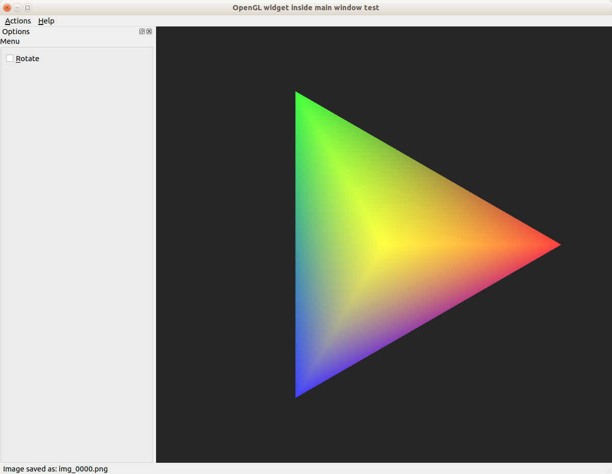

# MyGLWidget
A template of an OpenGL widget inside an application widow

This template is aimed to create an application that
contains:

* An app widget, with a sidebar, menu status bar and a
  central widget inheriting from QOpenGLWidget that can
  be used for rendering a scene.

* Go into full-screen mode

* A simple "Hello world" example, that renders simple tetrahedron

* All the [features](../README.md) common to the other templates.

## Usage

You need to have a working installation of Qt. Ideally, one that includes QtCreator. In that case you need to clone (or extract) the MyGLWidget folder inside of your Qt workspace and then
fullfill the rest of the requisites which are easy to deduct from the [Qt pro file](MyGLWidget.pro)
