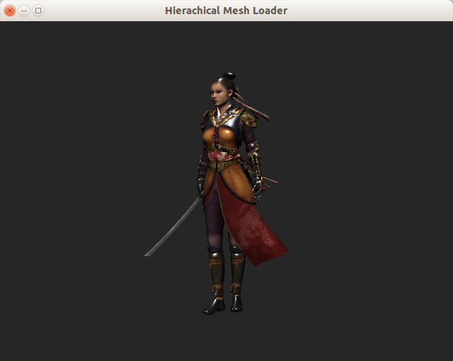

# MyGLWidow
A template of a single window for render OpenGL

This template is aimed to create one window application that
only contains OpenGL graphics.

It also features

* An example of using the model loader classes, to load and render an hierachical mesh.

* All the [features](../README.md) common to the other templates.

## Usage

I tested with a model from [here](http://www.cgtrader.com/free-3d-models/character/woman/nyra-game-model).

You need to have a working installation of Qt. Ideally, one that includes QtCreator. In that case you need to clone (or extract) the MyGLWindow folder inside of your Qt workspace and then
fullfill the rest of the requisites which are easy to deduct from the [Qt pro file](MyGLWindow.pro)
This sample also uses the [Open Asset Importer](http://www.assimp.org/) library.