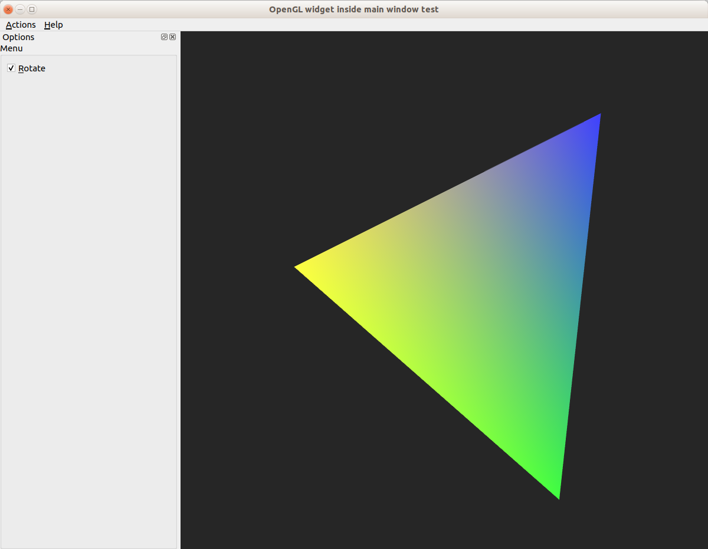
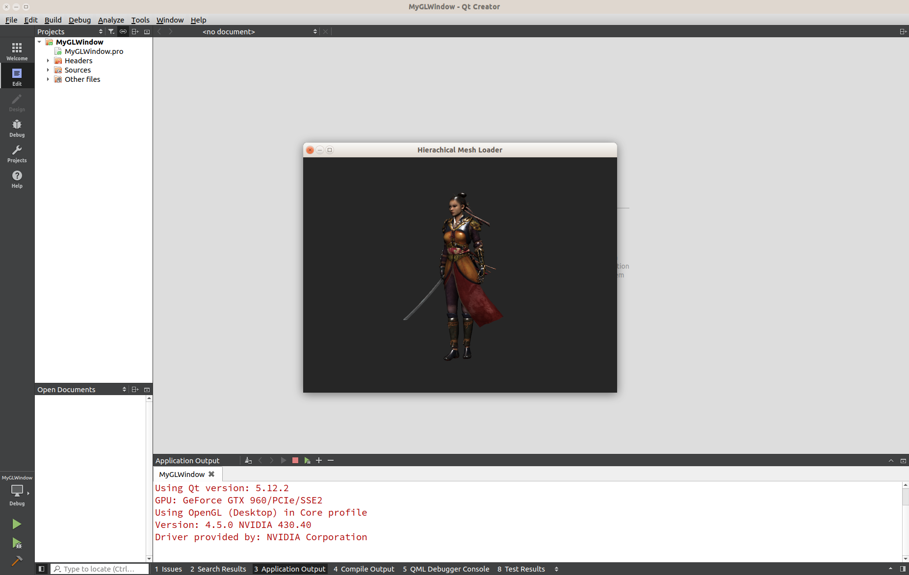
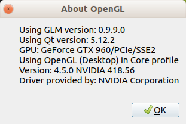
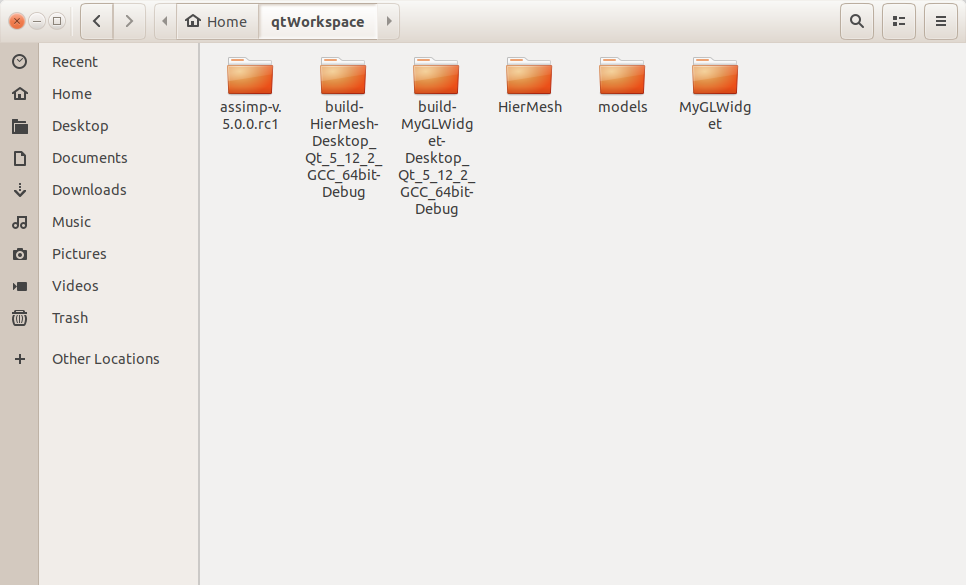

# QtOpenGLTemplate

A set of templates to develop OpenGL appliations using Qt

These templates are aimed to create an application that
contains:

* An already made connection with a QOpenGLDebugLogger
  that output OpenGL debug messages to console.

* Placeholder ask for a very specific OpenGL context and version

* Query OpenGL and Qt Versions actually used

* Take screnshoots in png format

* Uses [GLM](http://glm.g-truc.net) for the mathematics code since its univerally adopted

  * And includes conversion functions between GLM basic types and
    equivalent Qt types, so you can use Qt-OpenGL helper functionality

* A class to abstract a simple trackball camera.

The aim of the templates is to have minimal code that let you focus
in the OpenGL rather than the Qt.

They are perfect to start learning OpenGL using the [RedBook](http://www.opengl-redbook.com/) or the [OpenGL SuperBible](http://www.openglsuperbible.com/). Or by following any of the websites [OpenGL tutorial](http://www.opengl-tutorial.org/) and [Learn OpenGL](https://learnopengl.com/)

If you follow any of the above, you can (and should) use this template instead of GLEW, glf, freeglut, etc. This template substitute a windows manager library and an OpenGL loader library.
Since Qt already has an image loader, you will only need a mesh loader library like [Open Asset Importer](http://www.assimp.org/) in order to fullfill your graphics needs.

## Usage

For using any of these templates you need to have a working installation of Qt.
Ideally, one that includes QtCreator. You will also need to have GLM and in case
you want to use the model loader [assimp](http://www.assimp.org/)

The recomended way to use them, is to place the GLM and assimp in your QtWorkspace (the one cloned from here) folder. This way you can easily share them between projects.

You can see the details to configure the build for each teamplate in their respective `*.pro` files.
